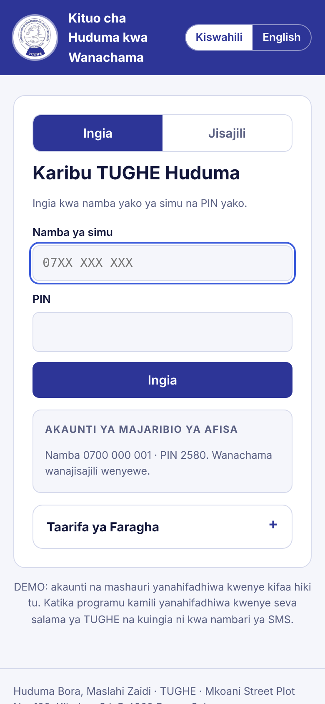
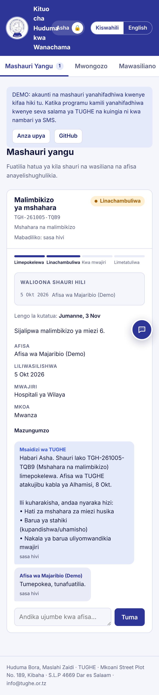
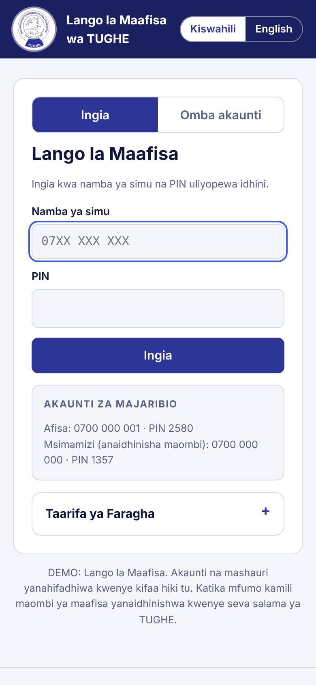
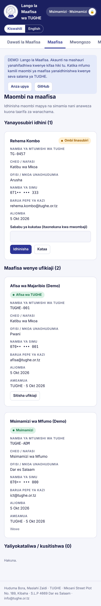
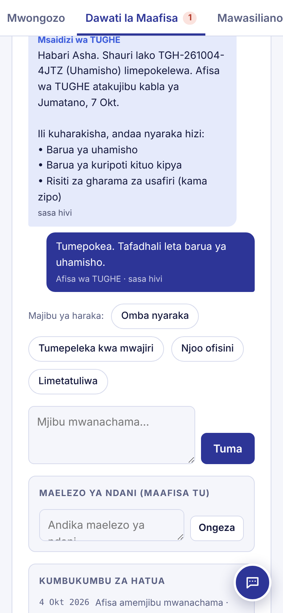

# TUGHE Huduma

**Kituo kimoja cha huduma kwa wanachama wa TUGHE.** Members of the Tanzania Union of Government and Health Employees use it to report workplace problems, track them to resolution and get instant answers. Officers use it to work every case against a deadline.

There are two separate interfaces:

| | For | Web | Android |
|---|---|---|---|
| **TUGHE Huduma** | Members: register, report problems, track their cases | **https://nyangehance-netizen.github.io/tughe-huduma/** | **[TUGHE-Huduma-demo.apk](https://github.com/nyangehance-netizen/tughe-huduma/releases/latest/download/TUGHE-Huduma-demo.apk)** |
| **TUGHE Dawati** (Lango la Maafisa) | Officers and service providers: apply for access, get approved, work the desk | **https://nyangehance-netizen.github.io/tughe-huduma/officer.html** | **[TUGHE-Dawati-demo.apk](https://github.com/nyangehance-netizen/tughe-huduma/releases/latest/download/TUGHE-Dawati-demo.apk)** |

On Android, open the downloaded file and, if the phone asks, allow installing apps from this source. On **iPhone**, open the web link in Safari, tap Share, then **Add to Home Screen**.

**How it works**
- **Members** tap **Jisajili / Register** in TUGHE Huduma, accept the privacy notice and choose a PIN.
- **Officers** tap **Omba akaunti / Apply** in TUGHE Dawati and enter their staff number, position, office and work email. They also accept a confidentiality pledge. They see nothing about members until an administrator approves them.
- The **administrator** approves or rejects applications, and can suspend an officer at any time, in the *Maafisa / Officers* tab.
- An officer account can't sign in to the members' app, and a member account can't sign in to the officers' portal.

**Demo accounts** (officers' portal):
- Officer: **0700 000 001**, PIN **2580**
- Administrator: **0700 000 000**, PIN **1357**

**Security in the demo**
- Each person's details are encrypted with their PIN.
- 5 wrong PINs lock the account for 5 minutes, and the app locks itself when not in use.
- Members see only their own cases, plus the name of every officer who opened them.
- Members can see all their data or delete their account from **Akaunti → Faragha**.
- Accounts and cases stay on the device that created them, so to try the full flow on one device, use both web links in the same browser.
- **Anza upya / Reset demo** clears everything.

| Members' sign-in | My case | Officers' portal | Approving officers | Officers' desk |
|---|---|---|---|---|
|  |  |  |  |  |

## What's in this repository

| Folder | What it is |
|---|---|
| [`docs/`](docs) | The live web demo, published by GitHub Pages: `index.html` is the members' app and `officer.html` is the officers' portal |
| [`android-demo/`](android-demo) + [`.github/workflows`](.github/workflows) | Turns the demo into two installable Android apps. GitHub builds it automatically and posts it on the [Releases page](https://github.com/nyangehance-netizen/tughe-huduma/releases) |
| [`mobile/`](mobile) | The real **Android and iOS apps**, TUGHE Huduma for members and TUGHE Dawati for officers, built from one React Native / Expo codebase, and its **Supabase backend**: database, security rules, deadlines, push notifications and the AI assistant. Setup and publishing steps are in [`mobile/README.md`](mobile/README.md) |

## Features

- **Report a problem.** Ten problem types (salary and arrears, promotion, transfer, discipline, leave, safety, pension, membership, harassment, other). Each report gets a reference number such as `TGH-261004-K7QD`.
- **Service times.** Normal cases get a reply within 3 working days and are resolved within 21. Urgent cases get a reply within 1 working day and are resolved within 7. Discipline and harassment cases are marked urgent automatically.
- **Track and chat.** Members see a progress bar and their deadlines, and message the officer handling their case.
- **Officers' desk.** Overdue cases come first. Officers can assign cases to themselves, change the stage, extend a deadline, use reply templates or an AI draft, and keep internal notes and an activity log. A written resolution is required before a case can be closed.
- **Assistant (Msaidizi).** It instantly answers leave entitlements, how to join, contacts and guidance for each problem type. It tracks a case from its reference number and opens the right form. In the mobile app, harder questions go to AI.
- **Kiswahili and English**, light and dark mode, and TUGHE blue `#2D3597` throughout.

## Demo vs. real app

| | Web demo (`docs/`) | Mobile app (`mobile/`) |
|---|---|---|
| Runs on | Any browser; can be installed to the home screen | Android and iPhone (Play Store / App Store) |
| Data | Example cases plus whatever you add, on this device only | Shared, secure database (Supabase) |
| Sign-in | Phone number + PIN, accounts stored on the device | Phone number + SMS code, fingerprint/face app lock; officers get the desk |
| Notifications | — | Push notifications for replies, urgent cases and the morning deadline reminder |
| AI answers | Built-in answers only | Built-in answers + AI (Claude) |

---
*Huduma Bora, Maslahi Zaidi.* TUGHE · Mkoani Street Plot No. 189, Kibaha · P.O. Box 4669 Dar es Salaam · info@tughe.or.tz
