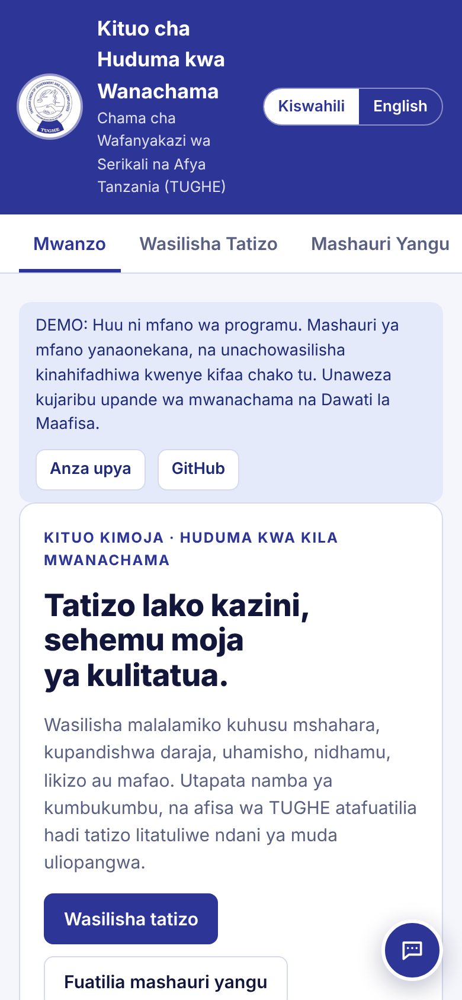

# TUGHE Huduma

**Kituo kimoja cha huduma kwa wanachama wa TUGHE.** Members of the Tanzania Union of Government and Health Employees use it to report workplace problems, track them to resolution and get instant answers. Officers use it to work every case against a deadline.

### ▶ Live demo: **https://nyangehance-netizen.github.io/tughe-huduma/**

Open the link on a phone or a computer. On a phone, choose **Add to Home Screen** and it runs like an app, even offline. The demo shows example cases, and anything you submit is saved only on your own device. Tap **Anza upya / Reset demo** to start again.

| Member home | My case | Officers' desk | Assistant |
|---|---|---|---|
|  |  |  |  |

## What's in this repository

| Folder | What it is |
|---|---|
| [`docs/`](docs) | The live web demo, published by GitHub Pages: a single page with no server |
| [`mobile/`](mobile) | The real **Android and iOS app** (React Native / Expo) and its **Supabase backend**: database, security rules, deadlines, push notifications and the AI assistant. Setup and publishing steps are in [`mobile/README.md`](mobile/README.md) |

## Features

- **Report a problem.** Ten problem types (salary and arrears, promotion, transfer, discipline, leave, safety, pension, membership, harassment, other). Each report gets a reference number such as `TGH-261004-K7QD`.
- **Service times.** Normal cases get a reply within 3 working days and are resolved within 21. Urgent cases get a reply within 1 working day and are resolved within 7. Discipline and harassment cases are marked urgent automatically.
- **Track and chat.** Members see a progress bar and their deadlines, and message the officer handling their case.
- **Officers' desk.** Overdue cases come first. Officers can assign cases to themselves, change the stage, extend a deadline, use reply templates or an AI draft, and keep internal notes and an activity log. A written resolution is required before a case can be closed.
- **Assistant (Msaidizi).** It instantly answers leave entitlements, how to join, contacts and guidance for each problem type. It tracks a case from its reference number and opens the right form. In the mobile app, harder questions go to AI.
- **Kiswahili and English**, light and dark mode, and TUGHE blue `#2D3597` throughout.

## Demo vs. real app

| | Web demo (`docs/`) | Mobile app (`mobile/`) |
|---|---|---|
| Runs on | Any browser; can be installed to the home screen | Android and iPhone (Play Store / App Store) |
| Data | Example cases plus whatever you add, on this device only | Shared, secure database (Supabase) |
| Sign-in | None; you see both the member and officer views | Phone number + SMS code; officers get the desk |
| Notifications | — | Push notifications for replies, urgent cases and the morning deadline reminder |
| AI answers | Built-in answers only | Built-in answers + AI (Claude) |

---
*Huduma Bora, Maslahi Zaidi.* TUGHE · Mkoani Street Plot No. 189, Kibaha · P.O. Box 4669 Dar es Salaam · info@tughe.or.tz
